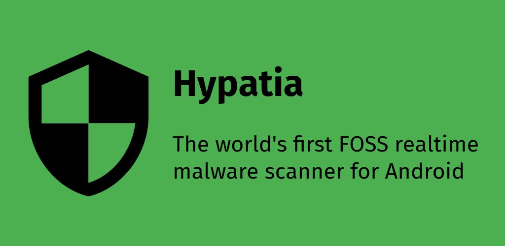

> [!WARNING]
> ### This is a fork of the [original](https://github.com/Divested-Mobile/Hypatia) (and discontinued) app, **which is still looking for maintainers**. Please consider to [apply](https://github.com/MaintainTeam/Hypatia/issues/1) to keep this app maintained !

Hypatia
=======

Overview
--------
Hypatia is the world's first FOSS malware scanner for Android. It is powered by ClamAV style signature databases.

<!--  -->

Features
--------
- Near zero battery impact: you'll never notice any impact on battery at all
- Extremely fast: it can scan small files (1MB) in <20ms, and even large files (40MB) in 1000ms.
- Memory efficient: with the default databases enabled it uses under 120MB.
- Regular scan: allowing selection of /system, internal storage, external storage, and installed apps
- Realtime scanner: can detect malware in realtime on write/rename in internal storage
- Completely offline: Internet is only used to download signature databases, files will never ever leave your device
- Persistence: will automatically restart on boot/update
- Tiny codebase: coming in at under 1000 sloc, it can be audited by even someone with basic programming experience
- Minimal dependencies: the app only uses libraries when necessary
- Signature databases can be enabled/disabled at the users demand

Signature Databases
-------------------
We currently have 2 working signature database server provider. Both Signing keys are `5298C0C0C3E73288`
> [!WARNING]
> Codeberg sometimes return 500 (see https://github.com/MaintainTeam/Hypatia/issues/11#issuecomment-2693793420)
- [Codeberg](https://codeberg.org/MaintainTeam/HypatiaDatabases/)
  - to use in app & see generation reports: https://maintainteam.codeberg.page/HypatiaDatabases/
- [GitHub](https://github.com/MaintainTeam/HypatiaDatabases/)
  - to use in app & see generation reports: https://maintainteam.github.io/HypatiaDatabases/

Database updates occurs in per 2 day about at 01 AM - 03 AM in both provider to `unsigned` branch. Then signing process made by self-hosted CI and push to `gh-pages`/`pages` branch about 06 AM. Each provider will generate static web-server from these branches. (UTC)

Technical Details
------------------
- Signature databases are serialized Guava BloomFilter object format
- Signature databases will not be redownloaded if the file hasn't changed on the server (304 not modified)
- Signatures are stored using BloomFilters for O(k) lookup
- Files have their MD5/SHA-1/SHA-256 hashes calculated in one pass
- Realtime scanner is multithreaded and will use half of the device's core count for scanning multiple files asynchronously
- Realtime scanning powered by a recursive FileObserver

Planned Updates
----------------
- Option to scan on access
- Scan newly installed/updated apps
- Option to let 3rd-party apps invoke scans
- Automatic database updates
- Database sanity checks
- Testing
- Better GUI
- Translations
- Scanning entire system using root (low priority)

Goals
-----
- Be fast
- Don't eat batteries
- Use minimal permissions
- Use libraries only when necessary

Credits
-------
- ClamAV for the databases (GPLv2)
- ESET for extra databases (BSD 2-Clause)
- Nex (@botherder) for extra databases (CC BY-SA 4.0)
- Amnesty International for extra databases (CC BY 2.0)
- Echap for extra databases (CC BY 4.0)
- MalwareBazaar for extra databases (CC0)
- RecursiveFileObserver.java (GPL-3.0-or-later): Daniel Gultsch, ownCloud Inc., Bartek Przybylski
- GPGDetachedSignatureVerifier.java (GPL-2.0-or-later): Federico Fissore, Arduino LLC
- Petra Mirelli for the app banner/feature graphic and various tweaks.
- @eloitor: Translations work
- Icons: Google/Android/AOSP, License: Apache 2.0, https://google.github.io/material-design-icons/

Translations
------------
- Afrikaans: Oswald van Ginkel
- Arabic: abdelbasset jabrane, ABDO GM
- Chinese (Simplified): Sdarfeesh, Crit, 大王叫我来巡山
- Chinese (Traditional Han script): 張可揚
- Croatian: lukapiplica
- Czech: Fjuro
- Estonian: Priit Jõerüüt
- Finnish: huuhaa, Ricky Tigg
- French: cardpuncher, Jean-Luc Tibaux, Petra Mirelli, thraex
- Galician: ghose, josé m
- German: thereisnoanderson, Balthazar1234, Petra Mirelli, Ettore Atalan
- Greek: Dimitris Vagiakakos
- Indonesian: Adrien N
- Italian: Tommaso Fonda, srccrow, Petra Mirelli, Dark Space
- Japanese: honyaku
- Polish: Marcin Mikołajczak
- Portuguese (Brazil): lucasmz
- Portuguese: jontaix, inkhorn, ssantos
- Romanian: Renko
- Russian: yurtpage, q1011, Andrey
- Slovak: Pa Di
- Spanish: gallegonovato, Manuel-Senpai, Petra Mirelli
- Turkish: cardpuncher
- Ukrainian: Fqwe1

Notices
-------
- Divested Computing Group is not affiliated with Cisco or ESET
- MaintainTeam is not affiliated with Cisco or ESET
- Hypatia is not sponsored or endorsed by Cisco or ESET
